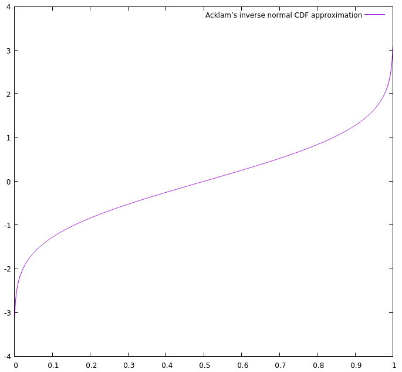

# DUMP: Dump of Unsorted Morsels for Programmers

**What is this?** This is a repository of more or less random programming things, which I am making for my own amusement and edification (and reference,I guess).  I don't know how this will evolve over time (if at all), but I imagine this will consist mainly in implementations of algorithms and data structures.

**What is in?** DUMP is composed of two main parts: the [morsels](#morsels) and the [plates](#plates). Morsels are the *raison d'être* of this "project", they are the "programming things" themselves. Plates are things made with the morsels: demonstrations, benchmarks, perhaps visualizations. A third part, [additives](#additives) (yeah, I am abusing the the metaphor!) are some infrastructure and utilities used by the two main parts.

**Which language and why?** I wanted to include both code and written notes about the "programming things". I soon noted that [literate programming](https://en.wikipedia.org/wiki/Literate_programming) would be a nice tool for this endeavor, so I quickly hacked a Markdown-based tool for this task: [Halp](https://github.com/lmbarros/Halp) (there already several other, arguably better Markdown-based literate programming tools around; I just wanted something slightly different than them). So, this very file is DUMP's source code. I use Halp to extract the code snippets to files that can be further compiled.

Concerning the code itself: given the reference aspect of DUMP, I'd prefer to write everything in C (The One True Lingua Franca of Computing and one that will probably be around for a long time). Too bad I can't stand writing much C anymore. So, I am resorting to C++ (which wouldn't be my number one choice for pretty much anything else these days). I'll try to restrain myself to the C subset of C++ as much as I can while still having fun, especially in the morsels -- I'll be more liberal in the plates and additives.

**What else?** Needless to say, this is by no means a library of ready-to-reuse stuff.

**Licensing.** DUMP is licensed under the [CC BY-NC-SA 4.0](https://creativecommons.org/licenses/by-nc-sa/4.0/) license. The code snippets are also licensed under the [MIT license](LICENSE.MIT.md). See [LICENSE.md](LICENSE.md) for details.


## <a name="morsels"></a>Morsels

<!-- Morsel template

### Name

**Summary:** Blah.

**AKA:** Blah.

**Complexity:** O(*n*)

**See also:** [Other morsel](#other-morsel)

**Keywords:** Skeleton, keyhole, lock, public, private.

#### Notes and Implementation

Blah, blah, implementation, blah, blah...

#### References

* Wikipedia, *[Morsel](https://en.wikipedia.org/wiki/Morsel)*.
* Author, *Book title*, Edition. Publisher, Year. (Page 123.)
* Author, *Paper title*. Conference/Magazine, Year.
* Eric W. Weisstein, *[Article Name](http://mathworld.wolfram.com/Article.html)*. Wolfram's MathWorld.

-->

### Acklam's Inverse Normal CDF Approximation Algorithm

**Summary:** Calculate a good approximation of the inverse normal CDF at any given point in the (0, 1) interval.

**Keywords:** Inverse normal CDF, inverse normal cumulative distribution function, normal distribution quantile function, probit.

#### Notes and Implementation

The inverse cumulative distribution function (CDF) of the normal distribution does not have a closed form. This algorithm provides an approximation of this function, which seems to be quite accurate (see details in the references). It was devised by Peter John Acklam in the early 2000s (maybe late 1990s, I am estimating these dates), who posted it to his personal web page.

One use of this function is to generate random numbers following a normal (Gaussian) distribution. There are many other uses, I am sure, but I cannot comment about them.

The following implementation is a pretty straightforward conversion of the pseudocode originally published by Mr. Acklam himself.

⟨Acklam’s inverse normal CDF approximation⟩ =
```C++
#include <cmath>
#include <cassert>

double acklams_inverse_normal_cdf(double p) {
    assert(p > 0.0 && p < 1.0);

    // Coefficients in rational approximations
    const double a1 = -3.969683028665376e+01;
    const double a2 =  2.209460984245205e+02;
    const double a3 = -2.759285104469687e+02;
    const double a4 =  1.383577518672690e+02;
    const double a5 = -3.066479806614716e+01;
    const double a6 =  2.506628277459239e+00;

    const double b1 = -5.447609879822406e+01;
    const double b2 =  1.615858368580409e+02;
    const double b3 = -1.556989798598866e+02;
    const double b4 =  6.680131188771972e+01;
    const double b5 = -1.328068155288572e+01;

    const double c1 = -7.784894002430293e-03;
    const double c2 = -3.223964580411365e-01;
    const double c3 = -2.400758277161838e+00;
    const double c4 = -2.549732539343734e+00;
    const double c5 =  4.374664141464968e+00;
    const double c6 =  2.938163982698783e+00;

    const double d1 =  7.784695709041462e-03;
    const double d2 =  3.224671290700398e-01;
    const double d3 =  2.445134137142996e+00;
    const double d4 =  3.754408661907416e+00;

    // Break-points
    const double pLow  = 0.02425;
    const double pHigh = 1 - pLow;

    // Rational approximation for lower region
    if (p < pLow) {
        const double q = std::sqrt(-2 * std::log(p));
        return (((((c1 * q + c2) * q + c3) * q + c4) * q + c5) * q + c6) /
            ((((d1 * q + d2) * q + d3) * q + d4) * q + 1);
    }

    // Rational approximation for central region
    else if (p <= pHigh) {
       const double q = p - 0.5;
       const double r = q * q;
       return (((((a1 * r + a2) * r + a3) * r + a4) * r + a5) * r + a6) * q /
           (((((b1 * r + b2) * r + b3) * r + b4) * r + b5) * r + 1);
    }

    // Rational approximation for upper region
    else {
        const double q = std::sqrt(-2 * std::log(1-p));
        return -(((((c1 * q + c2) * q + c3) * q + c4) * q + c5) * q + c6) /
            ((((d1 * q + d2) * q + d3) * q + d4) * q + 1);
    }
}
```


#### References

* [Peter John Acklam's home page](http://home.online.no/~pjacklam/notes/invnorm/) (broken link)
* [Peter John Acklam's home page on the Wayback Machine](https://web.archive.org/web/20151110174102/http://home.online.no/~pjacklam/notes/invnorm/)
* [A post I made about the algorithm](https://stackedboxes.org/2017/05/01/acklams-normal-quantile-function/)


### Euclidean Algorithm

**Summary:** Given two numbers, find their greatest common divider (GCD).

**AKA:** Euclid's Algorithm

**Keywords:** GCD, greatest common divisor, GCF, greatest common factor HCF, highest common factor, GCM, greatest common measure, HCD, highest common divisor.

#### Notes and Implementation

Popularized by Euclid's Elements (circa 300 BC) but possibly discovered at least a handful of decades earlier, it is one of the oldest algorithms still regularly used.

Here's a good way to visualize this algorithm in action. You want to compute the GCD of two numbers, *a* and *b*. Start picturing a rectangle measuring *a*×*b*. Finding the GCD is equivalent to finding the size of the largest square tile that could be used to fully cover this rectangle.

The original formulation given by Euclid himself was based on successive subtractions, which can be seen as a way to shrink the largest side of the said rectangle until we end up with a square. (Just notice that both sides may alternate as the largest one as the algorithm runs).

⟨Original Euclidean Algorithm⟩ =
```C++
int euclidean_algorithm_original(int a, int b) {
    while (a != b) {
        if (a > b)
            a -= b;
        else
            b -= a;
    }

    return a;
}
```

Nowadays, everybody uses a more efficient implementation, based on the modulo operator. It is the same idea as before -- we are just shrinking our rectangle faster.

⟨Euclidean Algorithm⟩ =
```C++
int euclidean_algorithm(int a, int b) {
    do {
        auto c = a;
        a = b % a;
        b = c;
    } while (a > 0);

    return b;
}
```

Finally, for the sake of completeness, here's a recursive variation of the algorithm -- also a common spot in the wild.

⟨Recursive Euclidean Algorithm⟩ =
```C++
int euclidean_algorithm_recursive(int a, int b) {
    if (b == 0)
        return a;
    else
        return euclidean_algorithm_recursive(b, a % b);
}
```

#### References

* Wikipedia, *[Euclidean Algorithm](https://en.wikipedia.org/wiki/Euclidean_algorithm)*.
* Robert Sedgewick, *Algorithms in C++*, Third Edition. Addison-Wesley, 1998. (Page 205.)
* Mladen Victor Wickerhauser, *Mathematics for Multimedia*. Birkhäuser, 2009. (Page 4.)


## <a name="plates"></a>Plates

### Acklam's Inverse Normal CDF Approximation Algorithm Demo

This is a simple demonstration of the inverse normal CDF approximation algorithm by Peter John Acklam. We simply call the algorithm for the whole supported input range, get the corresponding output values, and generated a file that can then be feed to `gnuplot` to produce a neat graphic.

⟨file:acklams_inverse_normal_cdf_demo.cpp⟩ =
```C++
#include <fstream>

⟨Acklam’s inverse normal CDF approximation⟩

int main()
{
    std::ofstream f("acklams_inverse_normal_cdf_demo.gnuplot");

    f << "plot '-' with lines title 'Acklam’s inverse normal CDF approximation'\n";

    double x = 0.001;
    while (x < 1.0) {
        f << x << " " << acklams_inverse_normal_cdf(x) << '\n';
        x += 0.001;
    }

    f << "e\n"
      << "pause mouse any\n";

    return 0;
}
```

This is the result:



### Euclidean Algorithm Test

This is just a simple test for the various implementations of the Euclidean Algorithm we discussed in the Morsels section.

⟨file:euclidean_algorithm_test.cpp⟩ =
```C++
⟨Assert routines for testing⟩

⟨Original Euclidean Algorithm⟩
⟨Euclidean Algorithm⟩
⟨Recursive Euclidean Algorithm⟩

int main() {
    dump_assert_equals(euclidean_algorithm_original(4, 2), 2);
    dump_assert_equals(euclidean_algorithm_original(12, 16), 4);
    dump_assert_equals(euclidean_algorithm_original(40, 11), 1);
    dump_assert_equals(euclidean_algorithm_original(356, 44), 4);

    dump_assert_equals(euclidean_algorithm(555, 33), 3);
    dump_assert_equals(euclidean_algorithm(33, 555), 3);
    dump_assert_equals(euclidean_algorithm(17, 17), 17);
    dump_assert_equals(euclidean_algorithm(56, 12), 4);

    dump_assert_equals(euclidean_algorithm_recursive(15, 5), 5);
    dump_assert_equals(euclidean_algorithm_recursive(1234, 4321), 1);
    dump_assert_equals(euclidean_algorithm_recursive(3000, 69), 3);
    dump_assert_equals(euclidean_algorithm_recursive(12, 501), 3);
}
```

## <a name="additives"></a>Additives

Additives are assorted utilities used by the morsels and plates.

### Testing

The most fundamental testing facilities are a nice set of `assert`-like routines. This particular implementation is tailored for DUMP's needs: simple test applications that are showcases of the morsels. We want to be very explicit about what the test is testing, that's why we are quite verbose even when the test succeeds. As for failures, we bail out on the first error, because our tests here we are expected to always succeed.

We use a pair of `auto` intermediate variables (`a` and `b`) to make sure that the expressions passed as parameters are evaluated only once. By the way, we are well into the 21st century and I am still using preprocessor macros. Well, maybe the latest revisions of C++ have some cryptic replacement for them, but this will do for now.

⟨Assert routines for testing⟩ =
```C++
#include <iostream>
#include <cstdlib>

#define dump_assert_equals(exprA, exprB)                             \
    {                                                                \
        auto a = (exprA);                                            \
        auto b = (exprB);                                            \
        std::cout << #exprA << " == " << #exprB << "? ";             \
        if (a == b) {                                                \
            std::cout << "[Yup! " << a << " == " << b << "]\n";      \
        } else {                                                     \
            std::cout << "[Nope! " << a << " != " << b << "]\n";     \
            std::exit(1);                                            \
        }                                                            \
    }
```
