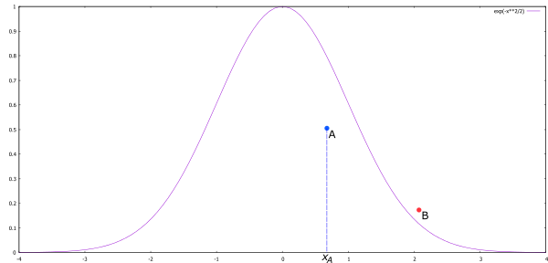

# Naïve Rejection Sampling

**Given a source of uniformly-distributed random numbers, generate random numbers that follow a given probability density function.**

First of all: As far as I know, the expression "naïve rejection sampling" doesn't have any "canonical" meaning. I am just using it as meaning "plain and simple rejection sampling, without any tricks".

Let's suppose we want to generate normally-distributed random numbers from a source of uniformly-distributed random numbers. We start by taking the [probability density function](https://en.wikipedia.org/wiki/Probability_density_function) (PDF) of the normal distribution. In fact, we can be a little sloppy here. The integral of the real PDF over its entire range must be equals to one; here, we are interested only in the relative values, so we can just ignore those annoying [normalizing constants](https://en.wikipedia.org/wiki/Normalizing_constant). So, here is a plot of an (unnormalized) normal distribution:



Now, we randomly (and uniformly!) generate a point over this picture. If the points falls underneath the PDF curve, as the blue A point in the picture, we project this point to the *x* axis (*x<sub>A</sub>*, in the example) and this value is "accepted" (that is, we can return it as one of our normally-distributed numbers). However, if the random points falls above the PDF curve (as the red *B* point in the picture), we reject (discard) it, and try again with a new random point.

This naïve approach is inefficient for at least two reasons. First, because we have to evaluate the PDF for each point. Second, because a large fraction of the points will end up being rejected. Smarter rejection-based algorithms employ some tricks to mitigate these inefficiencies.

### Implementation: Generate normally-distributed random numbers

One thing we'll do a lot is checking if our random points are over or under the normal PDF curve. So, let's define a function to evaluate this curve. As explained above, we can safely (and fortunately) ignore the scaling constant:

⟨Define the normal unnormalized PDF⟩ +=
```C++
#ifndef _DUMP_NORMAL_UNNORMALIZED_PDF_DEFINED_
#define _DUMP_NORMAL_UNNORMALIZED_PDF_DEFINED_
#include <cmath>
using namespace std;

double normal_unnormalized_pdf(double x) {
    return exp((-x*x)/2);
}
#endif
```

Now we can implement our random number generator based on the algorithm outlined above. There is one open question, though. Since the normal distribution is unbounded in the *x* axis, what would be a good number to use as the limit for the random points? I don't know. The number I am using was determined by trial and error. Numbers that are too large will hurt performance badly, as the rejection area will grow enormously. There are also floating-point precision issues at play, I guess (in my implementation, at least).

Anyway, other than this detail, the implementation is straightforward.

⟨Naïve Rejection Sampling normal RNG⟩ =
```C++
⟨Random number generator types⟩
⟨Define the normal unnormalized PDF⟩

#include <cstdint>
using namespace std;

double naive_rejection_sampling_normal_rng(dump_rng_uniform_01 rng) {
    while (true) {
        double u1 = (rng() - 0.5) * 100.0;
        double u2 = rng();

        double y = normal_unnormalized_pdf(u1);
        if (u2 < y)
            return u1;
    }
}
```

## Nutrition Facts

**AKA:** Acceptance-rejection method, Accept-reject algorithm.

**See also:** The [Ziggurat Algorithm](ziggurat_algorithm.md) is an example of "smart" rejection sampling. More stuff we can use to generate normally-distributed random numbers are seen in the [Normally-Distributed Random Numbers Demo](../plates/normally_distributed_random_numbers_demo.md).

**Keywords:** Rejection sampling, Monte Carlo method.

## References

* Wikipedia, *[Rejection sampling](https://en.wikipedia.org/wiki/Rejection_sampling)*.
