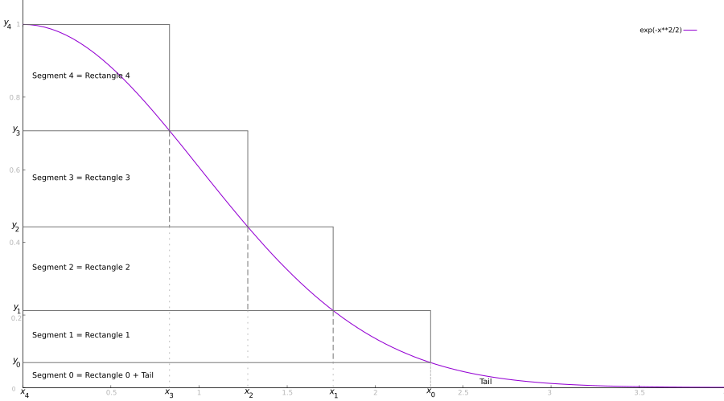

# Ziggurat Algorithm

**Given a source of uniformly-distributed random numbers, generate random numbers that follow a given probability density function that is either decreasing or symmetric unimodal.**

This is another brainchild of George Marsaglia, this time in collaboration with Wai Wan Tsang. It was firstly published in a 1984 paper (*A fast, easily implemented method for sampling from decreasing or symmetric unimodal density functions*), then improved in follow-up paper in 2000.

To understand how the algorithm works, start by understanding how the [naïve rejection sampling](naive_rejection_sampling.md) strategy works. The Ziggurat Algorithm circumvents this approach's efficiency issues by approximating the PDF by a bunch of stacked rectangles (stacked boxes?!), as shown below.



Let's take a closer look at this picture. The most important thing to notice is that these rectangles resemble the ancient Mesopotamian [ziggurats](https://en.wikipedia.org/wiki/Ziggurat). In addition of being a nice guy and all his technical and scientific contributions, George Marsaglia was also a master at naming things!

Next, notice that we are using just the half of the normal PDF. It turns out that the Ziggurat Algorithm, by itself, works only for decreasing PDFs (like the exponential distribution). However, we can easily handle [symmetric unimodal](https://en.wikipedia.org/wiki/Unimodality#Unimodal_probability_distribution) PDFs as the normal distribution by applying Ziggurat only to its decreasing half, and then swapping the signal of the resulting random numbers with a 50% probability. That's what we are doing in our example.

Now, notice that we created a total of five segments, numbered from zero to four. Segment 0 is special: it is composed of a rectangle, plus a tail that extends to infinity (though, notice that the segment area is finite!). This segment matches the PDF curve exactly: no part of it is "above" the curve.

Segments 1 to 4 are just rectangles. Here, we don't have perfect matches: the rightmost part of these rectangles are above the PDF. Nevertheless, we can easily see that there are "sub-rectangles" which are completely underneath the PDF. (This is not strictly true for our topmost rectangle: no slice of it is completely under the curve. Anyway, we'll pretend that there is a degenerate zero-with rectangle to the left of the Rectangle 4 we see in the picture. Yeah, we are just lying to ourselves, but this allows to deal with Segment 4 just like we deal with all other nonzero segments.)

One crucial detail is that all five segments, from Segment 0 to Segment 4, have exactly the same area. Just to be clear: we are talking the area of the segment itself, *not* about the PDF area that happens to intersect the segment. (By the way, don't try to measure my figure to check if the areas are the same. They aren't. Please focus on the concepts and pretend that the segments I've draw have all the same area.)

And the final point to highlight is that in real implementations we use much more than five segments. Marsaglia and Tsang recommend 256 or, at least, 128 segments. We'll use 256.

### The Ziggurat Algorithm itself

Let's ignore for a moment how to build the ziggurat. In other words, let's ignore how to determine the *x*s and *y*s marked in the figure, and just assume that magically we have arrays `x[]` and `y[]` with the proper values. Also, if you see `n` in the code below, it is the number of segments we are using (which happens to be 256, but doesn't really matter).

The structure is simple: an infinite loop in which we try random points until we find one that is not rejected (in which case it is returned). We generate one uniformly-distributed random integer number (`u0`) and use 8 of its bits to select one of the segments (`i`). We use one additional of its bits to determine the sign of the number to be returned (recall the discussion above, about symmetric unimodal distributions). Then we handle the selected segment, remembering that Segment 0 needs special handling (mostly because of the tail).

⟨Ziggurat Algorithm normal RNG⟩ =
```C++
⟨Random number generator types⟩
⟨Define the normal unnormalized PDF⟩

#include <climits>
using namespace std;

double ziggurat_algorithm_normal_rng(dump_rng_uniform_01 rng) {
    ⟨Define Ziggurat constants for n=256⟩

    while(true) {
        unsigned int u0 = rng() * UINT_MAX;
        int i = u0 & 0xFF;
        double sign = u0 & 0x100 ? 1.0 : -1.0;

        if (i == 0) {
            ⟨Ziggurat: Handle Segment 0⟩
        } else {
            ⟨Ziggurat: Handle Segments greater than 0⟩
        }
    }
}
```

Let's handle first the segments greater than zero. We start by drawing (from a uniform distribution) a number `u1` in the horizontal range of the `i`-th rectangle, which is between zero and `x[i-1]` (you can follow these steps looking at the figure). If this number is in the part of the rectangle that is fully under the PDF curve, we accept this number and simply return it (with the random signal we defined previously).

Here's one interesting thing: in a rejection sampling method like the Ziggurat Algorithm, what we do is to randomly create points over the PDF plot, right? We generated the *x* coordinate of this point (it's the `u1` above), but where is the *y* coordinate? When we randomly selected one of the segments (`i`), we were doing a low-resolution selection of the *y* coordinate.

Now, what if we are unlucky and `u1` falls in the region that is partially above the PDF? Then we need to generate a high-resolution *y* coordinate for our random point. That's the `yy` in the code below. We simply check if `yy` is under the PDF curve at our *x* coordinate `u1`.

⟨Ziggurat: Handle Segments greater than 0⟩ =
```C++
double u1 = rng() * x[i-1];
if (u1 < x[i]) {
    return u1 * sign;
} else {
    double yy = y[i-1] + rng() * (y[i] - y[i-1]);
    if (yy < normal_unnormalized_pdf(u1)) {
        return u1 * sign;
    }
}
```

Segment 0 is a bit more complicated. We cannot simply generate a number in the whole possible *x* range of this segment because Segment 0 is infinitely wide. However, the area of Segment 0 is finite, so we can use  it instead. Later I'll say a few words about how to determine this area; for now, just assume `a` contains this value.

We start by generating a uniformly-distributed number `u1` between 0 and the area of our segments, `a`. If this number is smaller than the area of the rectangle (`x[0] * y[0]`), then we know for sure that we are under the PDF curve: we can just convert random the area `u1` to a proper *x* coordinate and return it.

Otherwise, we are on the tail, which needs a very special handling. I don't really understand how this works, I am just doing what the Ziggurat Algorithm paper says to do (Dr. Marsaglia wrote a whole paper just about this part).

⟨Ziggurat: Handle Segment 0⟩ =
```C++
double u1 = rng() * a;
if (u1 < x[0] * y[0]) {
    return u1 / y[0] * sign;
} else {
    double xx, yy;
    do {
        xx = -log(rng()) / x[0];
        yy = -log(rng());
    } while(yy+yy <= xx*xx);

    return (x[0] + xx) * sign;
}
```

And that's it! The Ziggurat algorithm. With 256 boxes, we'll use the fast path 99.33% of the time. Nice, uh?

Oh, you still have some questions? Like, why must all segments have the same area? Or, why do we never reject a point when Segment 0 is selected? I am tired of typing and will not explain this. It's not *that* hard to figure out. Hint: both answers are closely related.

## Building the ziggurat

OK, everything we did so far was relatively straightforward, but a real implementation needs all the `x[]`, `y[]` and `a` values. These values depend on the number of boxes (`n`) you decide to use. Looking again at the figure, try to convince yourself that it is reasonably easy to find all the `x[]` and `y[]` values as long as you know:

* The inverse of your PDF.
* The area, `a`.
* The horizontal coordinate of the rightmost rectangle, `x[0]`.

The inverse PDF is not such a big deal (took me some time to remember how to do it, but anyway):

⟨Define the inverse normal unnormalized PDF⟩ =
```C++
#include <cmath>
using namespace std;

double inv_normal_unnormalized_pdf(double x) {
    return sqrt(-2.0*log(x));
}
```

As for `a` and `x[0]`, there are two ways to determine them:

1. Study a lot of Mathematics and Statistics, until you know much, much more than I do.
2. Just use the values that Marsaglia and Tsang kindly provide in their paper.

I used the second way.

So, using the magic numbers taken from the paper, we can write a program to determine the remaining values for `x[]` and `y[]`. This is a preprocessing step; we'll this help program to generate the numbers we need, then we'll just use these numbers in our Ziggurat implementation.

⟨file:ziggurat_algorithm_preprocess.cpp⟩ =
```C++
⟨Define the normal unnormalized PDF⟩
⟨Define the inverse normal unnormalized PDF⟩

#include <cstdio>

int main() {
    const int n = 256;

    double x[n];
    double y[n];

    const double a = 0.00492867323399;

    x[0] = 3.6541528853610088;
    y[0] = normal_unnormalized_pdf(x[0]);

    for (int i = 1; i < n; ++i) {
        y[i] = y[i-1] + a/x[i-1];
        x[i] = inv_normal_unnormalized_pdf(y[i]);
    }

    x[n-1] = 0.0;

    printf("static const double x[%i] = { %lf", n, x[0]);
    for (int i = 1; i < n; ++i)
        printf(", %lf", x[i]);
    printf(" }\n");

    printf("static const double y[%i] = { %lf", n, y[0]);
    for (int i = 1; i < n; ++i)
        printf(", %lf", y[i]);
    printf(" }\n");

    printf("i=%i\tx,y = %lf, %lf\n", 0, x[0], y[0]);
    for (int i = 1; i < n; ++i)
        printf("i=%i\tx,y = %lf, %lf --> [a = %lf]\n", i, x[i], y[i], x[i-1] * (y[i] - y[i-1]));

    return 0;
}
```

That last `for` loop was just for sanity checking; I wanted to see the generated numbers and be sure that all areas were indeed equal (and equal to ou magic `a`).

Cool, so this program generates the numbers we needed to build our ziggurat. This was the last bit we need to complete our implementation.

⟨Define Ziggurat constants for n=256⟩ =
```C++
const int n = 256;
const double a = 0.00492867323399;

static const double x[n] = {
    3.654153, 3.449278, 3.320245, 3.224575, 3.147889, 3.083526, 3.027838, 2.978603,
    2.934367, 2.894121, 2.857139, 2.822877, 2.790921, 2.760944, 2.732685, 2.705934,
    2.680515, 2.656283, 2.633116, 2.610911, 2.589576, 2.569035, 2.549222, 2.530075,
    2.511544, 2.493583, 2.476150, 2.459208, 2.442725, 2.426671, 2.411018, 2.395743,
    2.380823, 2.366237, 2.351967, 2.337996, 2.324308, 2.310888, 2.297723, 2.284801,
    2.272109, 2.259637, 2.247375, 2.235313, 2.223443, 2.211757, 2.200246, 2.188903,
    2.177721, 2.166695, 2.155818, 2.145084, 2.134487, 2.124023, 2.113687, 2.103474,
    2.093380, 2.083400, 2.073530, 2.063768, 2.054108, 2.044548, 2.035084, 2.025714,
    2.016434, 2.007241, 1.998132, 1.989106, 1.980159, 1.971289, 1.962493, 1.953770,
    1.945117, 1.936531, 1.928012, 1.919557, 1.911165, 1.902832, 1.894559, 1.886342,
    1.878180, 1.870073, 1.862018, 1.854013, 1.846058, 1.838151, 1.830290, 1.822475,
    1.814703, 1.806975, 1.799288, 1.791641, 1.784034, 1.776464, 1.768932, 1.761436,
    1.753975, 1.746548, 1.739154, 1.731792, 1.724462, 1.717161, 1.709890, 1.702647,
    1.695432, 1.688243, 1.681081, 1.673943, 1.666830, 1.659741, 1.652674, 1.645630,
    1.638606, 1.631603, 1.624621, 1.617657, 1.610712, 1.603784, 1.596874, 1.589980,
    1.583102, 1.576239, 1.569390, 1.562555, 1.555734, 1.548925, 1.542128, 1.535343,
    1.528568, 1.521803, 1.515048, 1.508302, 1.501564, 1.494834, 1.488110, 1.481394,
    1.474684, 1.467978, 1.461278, 1.454582, 1.447890, 1.441200, 1.434513, 1.427828,
    1.421144, 1.414461, 1.407778, 1.401095, 1.394410, 1.387724, 1.381035, 1.374344,
    1.367649, 1.360949, 1.354245, 1.347536, 1.340820, 1.334098, 1.327369, 1.320631,
    1.313885, 1.307129, 1.300363, 1.293587, 1.286799, 1.279998, 1.273185, 1.266358,
    1.259517, 1.252660, 1.245787, 1.238898, 1.231991, 1.225065, 1.218119, 1.211154,
    1.204167, 1.197158, 1.190126, 1.183069, 1.175988, 1.168880, 1.161745, 1.154581,
    1.147389, 1.140165, 1.132909, 1.125620, 1.118297, 1.110938, 1.103542, 1.096107,
    1.088631, 1.081114, 1.073554, 1.065949, 1.058296, 1.050596, 1.042844, 1.035040,
    1.027182, 1.019267, 1.011292, 1.003257, 0.995157, 0.986991, 0.978755, 0.970447,
    0.962064, 0.953602, 0.945059, 0.936429, 0.927711, 0.918898, 0.909988, 0.900975,
    0.891855, 0.882622, 0.873271, 0.863796, 0.854189, 0.844445, 0.834555, 0.824512,
    0.814307, 0.803929, 0.793369, 0.782615, 0.771654, 0.760473, 0.749057, 0.737387,
    0.725446, 0.713212, 0.700662, 0.687768, 0.674500, 0.660823, 0.646696, 0.632072,
    0.616897, 0.601105, 0.584617, 0.567338, 0.549152, 0.529910, 0.509423, 0.487444,
    0.463634, 0.437518, 0.408389, 0.375121, 0.335738, 0.286175, 0.215242, 0.000000 };

static const double y[n] = {
    0.001260, 0.002609, 0.004038, 0.005522, 0.007051, 0.008617, 0.010215, 0.011843,
    0.013497, 0.015177, 0.016880, 0.018605, 0.020351, 0.022117, 0.023902, 0.025706,
    0.027527, 0.029366, 0.031221, 0.033093, 0.034981, 0.036884, 0.038803, 0.040736,
    0.042684, 0.044647, 0.046623, 0.048614, 0.050618, 0.052635, 0.054666, 0.056711,
    0.058768, 0.060838, 0.062921, 0.065017, 0.067125, 0.069245, 0.071378, 0.073523,
    0.075680, 0.077849, 0.080031, 0.082224, 0.084429, 0.086645, 0.088874, 0.091114,
    0.093365, 0.095629, 0.097903, 0.100189, 0.102487, 0.104796, 0.107117, 0.109448,
    0.111792, 0.114146, 0.116512, 0.118889, 0.121277, 0.123676, 0.126087, 0.128509,
    0.130942, 0.133386, 0.135841, 0.138308, 0.140786, 0.143275, 0.145775, 0.148287,
    0.150809, 0.153343, 0.155888, 0.158445, 0.161012, 0.163591, 0.166181, 0.168783,
    0.171396, 0.174020, 0.176655, 0.179302, 0.181961, 0.184630, 0.187312, 0.190005,
    0.192709, 0.195425, 0.198153, 0.200892, 0.203643, 0.206405, 0.209180, 0.211966,
    0.214764, 0.217574, 0.220396, 0.223230, 0.226076, 0.228934, 0.231804, 0.234687,
    0.237582, 0.240489, 0.243408, 0.246340, 0.249284, 0.252241, 0.255211, 0.258193,
    0.261188, 0.264196, 0.267217, 0.270250, 0.273297, 0.276357, 0.279430, 0.282517,
    0.285616, 0.288730, 0.291857, 0.294997, 0.298151, 0.301319, 0.304501, 0.307697,
    0.310908, 0.314132, 0.317371, 0.320624, 0.323891, 0.327174, 0.330471, 0.333783,
    0.337110, 0.340452, 0.343810, 0.347183, 0.350571, 0.353975, 0.357395, 0.360831,
    0.364282, 0.367751, 0.371235, 0.374736, 0.378254, 0.381788, 0.385340, 0.388909,
    0.392495, 0.396099, 0.399720, 0.403360, 0.407017, 0.410693, 0.414388, 0.418101,
    0.421833, 0.425584, 0.429355, 0.433145, 0.436955, 0.440785, 0.444636, 0.448507,
    0.452399, 0.456312, 0.460246, 0.464203, 0.468181, 0.472182, 0.476205, 0.480251,
    0.484320, 0.488413, 0.492530, 0.496672, 0.500838, 0.505029, 0.509245, 0.513488,
    0.517757, 0.522052, 0.526375, 0.530725, 0.535104, 0.539511, 0.543948, 0.548414,
    0.552910, 0.557438, 0.561997, 0.566588, 0.571212, 0.575869, 0.580560, 0.585286,
    0.590048, 0.594846, 0.599682, 0.604555, 0.609468, 0.614421, 0.619414, 0.624450,
    0.629529, 0.634652, 0.639820, 0.645035, 0.650299, 0.655611, 0.660975, 0.666391,
    0.671862, 0.677388, 0.682972, 0.688616, 0.694322, 0.700092, 0.705929, 0.711834,
    0.717812, 0.723865, 0.729995, 0.736208, 0.742505, 0.748892, 0.755374, 0.761953,
    0.768637, 0.775431, 0.782342, 0.789376, 0.796542, 0.803849, 0.811308, 0.818929,
    0.826727, 0.834716, 0.842916, 0.851346, 0.860034, 0.869009, 0.878310, 0.887985,
    0.898096, 0.908726, 0.919992, 0.932060, 0.945199, 0.959879, 0.977102, 1.000000 };
```

## Nutrition Facts

**AKA:** Ziggurat Method.

**See also:** More stuff we can use to generate normally-distributed random numbers are seen in the [Normally-Distributed Random Numbers Demo](../plates/normally_distributed_random_numbers_demo.md).

**Keywords:** Normal distribution, Gaussian distribution, exponential distribution, random sampling, rejection sampling.

## References

* Wikipedia, *[Ziggurat algorithm](https://en.wikipedia.org/wiki/Ziggurat_algorithm)*.
* George Marsaglia and Wai Wan Tsang, *[The Ziggurat Method for Generating Random Variables](https://www.jstatsoft.org/article/view/v005i08)*. Journal of Statistical Software, vol. 5, no. 8, 2000.
* Colin Green, *[The Ziggurat Algorithm for Random Gaussian Sampling](http://heliosphan.org/zigguratalgorithm/zigguratalgorithm.html)*. Heliosphan, 2011.
* Cleve Moler, [The Ziggurat Random Normal Generator](https://blogs.mathworks.com/cleve/2015/05/18/the-ziggurat-random-normal-generator/). Cleve’s Corner: Cleve Moler on Mathematics and Computing. 2015.
