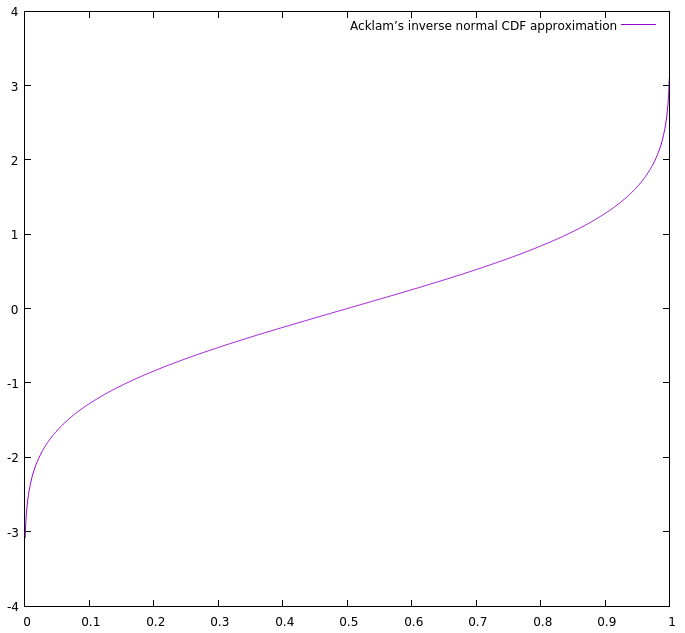

# Acklam's Inverse Normal CDF Approximation Algorithm Demo

This is a simple demonstration of the [inverse normal CDF approximation algorithm](../morsels/acklams_inverse_normal_cdf.md) by Peter John Acklam. We simply call the algorithm for the whole supported input range, get the corresponding output values, and generate a file that can then be feed to `gnuplot` to produce a neat graphic.

⟨file:acklams_inverse_normal_cdf_demo.cpp⟩ =
```C++
#include <fstream>
using namespace std;

⟨Acklam’s inverse normal CDF approximation⟩

int main()
{
    ofstream f("acklams_inverse_normal_cdf_demo.gnuplot");

    f << "plot '-' with lines title 'Acklam’s inverse normal CDF approximation'\n";

    double x = 0.001;
    while (x < 1.0) {
        f << x << " " << acklams_inverse_normal_cdf(x) << '\n';
        x += 0.001;
    }

    f << "e\n"
      << "pause mouse any\n";

    return 0;
}
```

This is the result:


