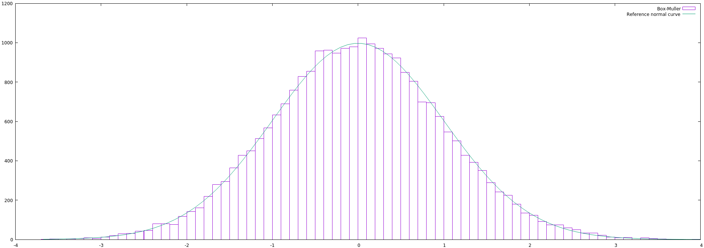

# Normally-Distributed Random Numbers Demo

This plate uses different methods to generate normally-distributed numbers and create a file that can be passed to `gnuplot` to plot the results.

## General file structure

Our demo source file is simple enough:

⟨file:normally_distributed_random_numbers_demo.cpp⟩ =
```C++
⟨Definitions for the Normally-Distributed Random Numbers Demo⟩

int main() {
    ⟨Main code for the Normally-Distributed Random Numbers Demo⟩
    return 0;
}
```

## Definitions from elsewere

We'll use many stuff related with random number generators (RNGs) defined elsewhere. Let's start with DUMP's own RNG additives:

⟨Definitions for the Normally-Distributed Random Numbers Demo⟩ =
```
⟨Random number generator types⟩
⟨Simple uniform (0,1) RNG⟩
```

Next, we'll use the RNGs defined in morsels -- these are the different methods we want to test:

⟨Definitions for the Normally-Distributed Random Numbers Demo⟩ +=
```
⟨Acklam’s inverse normal CDF approximation⟩
⟨Acklam’s normal RNG⟩

⟨Box-Muller Transform⟩
⟨Box-Muller normal RNG⟩

⟨Polar Method normal RNG⟩

⟨Ziggurat Algorithm normal RNG⟩

⟨Naïve Rejection Sampling normal RNG⟩
```

## The interesting part

Our main code starts by creating the file stream to where we'll write our `gnuplot` code.

⟨Main code for the Normally-Distributed Random Numbers Demo⟩ =
```C++
ofstream f("normally_distributed_random_numbers_demo.gnuplot");
```

Then we output some `gnuplot` code for plotting histograms.

⟨Main code for the Normally-Distributed Random Numbers Demo⟩ +=
```C++
f << "binwidth = 0.1\n"
  << "set boxwidth binwidth\n"
  << "bin(x, width) = width * floor(x/width) + binwidth/2.0\n\n";
```

For reference, we'll also plot a "real" normal curve overlaid on our histogram. Here is the formula for thus curve, including a nice magic number for scaling it to the histogram.

⟨Main code for the Normally-Distributed Random Numbers Demo⟩ +=
```C++
f << "normal(x) = 2500*(1/(sqrt(2*pi)))*exp(-x**2/2)\n";
```

We proceed by initializing our RNG.

⟨Main code for the Normally-Distributed Random Numbers Demo⟩ +=
```C++
dump_randomize_simple_uniform_01_rng();
```

And we finally create the actual plots by calling a helper function. In each call we pass the desired RNG, the file to where we'll write the `gnuplot` code, and the desired plot title.

⟨Main code for the Normally-Distributed Random Numbers Demo⟩ +=
```C++
plot(acklams_normal_rng, f, "Acklam");
plot(box_muller_normal_rng, f, "Box-Muller");
plot(polar_method_normal_rng, f, "Polar Method");
plot(ziggurat_algorithm_normal_rng, f, "Ziggurat Algorithm");
plot(naive_rejection_sampling_normal_rng, f, "Naive Rejection Sampling");
```

Speaking of helper function, here it is. We just have to output some more histogram-plotting code and call a RNG multiple times to generate the data to be plotted. Notice that use DUMP's `dump_simple_uniform_01_rng()` function as the underlying source of uniformly-distributed numbers.

⟨Definitions for the Normally-Distributed Random Numbers Demo⟩ +=
```C++
#include <fstream>
using namespace std;

void plot(dump_rng_normal rng, ostream& os, const char* title) {
    os << "plot '-' using (bin($1, binwidth)):(1.0) smooth freq with boxes "
       << "title '" << title << "',\\\n"

       << "   [-4:4] normal(x) title 'Reference normal curve'\n";

    for (int i = 0; i < 25000; ++i)
        os << rng(dump_simple_uniform_01_rng) << '\n';

    os << "e\n"
       << "pause mouse any\n\n";
}
```

And that's all. This will generate a sequence of plots like this:


